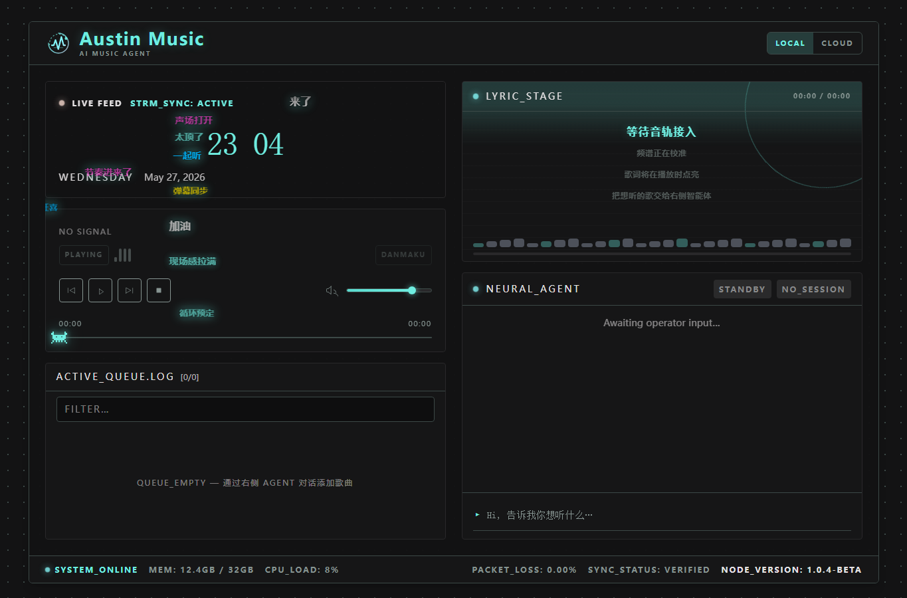
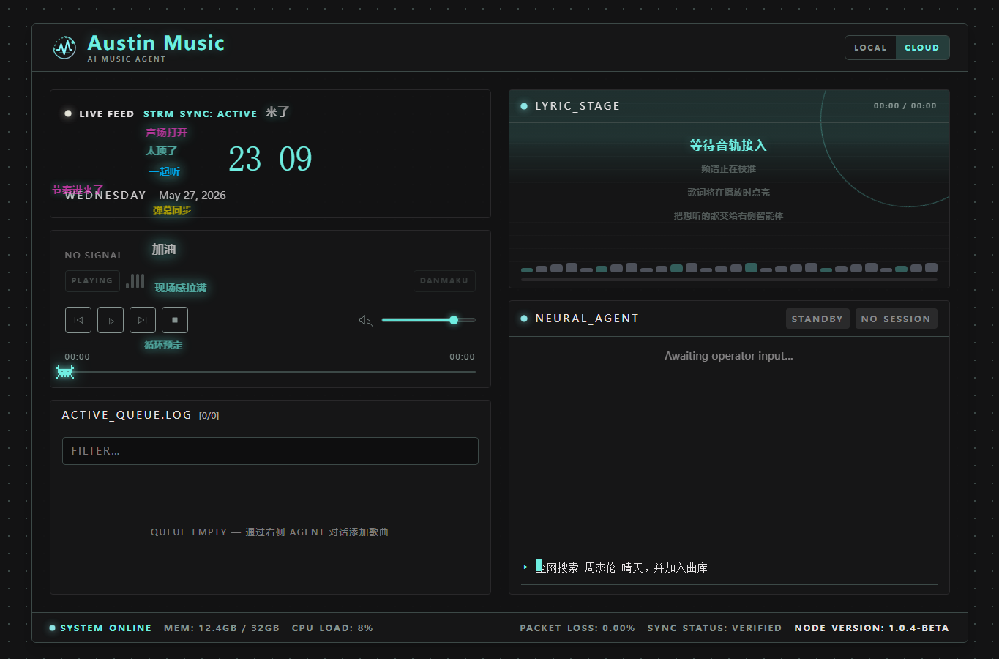

<p align="center">
  
</p>

<p align="center">
  <strong>Austin Music</strong><br />
  AI Music Agent, local library player, web search assistant, NetEase Music integration, lyrics stage and danmaku UI.
</p>

<p align="center">
  <a href="https://creativecommons.org/licenses/by-nc-sa/4.0/">
    
  </a>
  = 20" />
  
  
</p>

Austin Music 是一个基于 Next.js 的 AI 音乐播放器。它把本地曲库、AI 智能体搜索、全网检索、网易云音乐搜索、B站音频下载、歌词展示和弹幕视觉效果整合到一个复古终端风格界面中。





## 功能特性

- **本地曲库播放**：扫描 `MUSIC_DIR` 下的音频文件，支持搜索、加入播放队列和本地流式播放。
- **AI 智能体对话**：用自然语言描述想听的歌，AI 会根据意图搜索、推荐并生成可操作的歌曲卡片。
- **全网搜索**：支持网页搜索结果聚合，解决中文搜索在命令传输中的编码问题。
- **网易云音乐 API**：支持网易云歌曲搜索、歌词获取和可播放音频代理。
- **B站搜索与下载**：搜索 B站视频并通过下载任务转为本地音频，逐步沉淀个人曲库。
- **歌词舞台**：播放时在右侧展示歌词，支持 `.lrc` 时间轴歌词、`.txt` 普通歌词、`.krc` 解码，以及部分在线歌词回填。
- **弹幕流动效果**：左侧播放区域叠加横向滚动弹幕，增强音乐播放氛围。
- **动态节奏视觉**：播放时展示频谱条、进度线和节奏感 UI。
- **多格式播放**：本地曲库支持 `.mp3`、`.flac`、`.m4a`、`.aac`、`.ogg`、`.oga`、`.opus`、`.wav`、`.webm`。

## 技术栈

| 模块 | 技术 |
| --- | --- |
| 框架 | Next.js 16 App Router |
| UI | React 19, TypeScript 5 |
| 样式 | Tailwind CSS 4, CSS Variables |
| AI Agent | `@anthropic-ai/claude-agent-sdk` |
| 音乐源 | 本地文件, 网易云音乐, B站 |
| 搜索 | 本地曲库搜索, Web 搜索, B站搜索, 网易云搜索 |

## 快速开始

### 1. 环境要求

- Node.js 20 或更高版本
- npm
- 可选：DeepSeek 或 Anthropic API Key
- 可选：用于保存音乐文件的本地目录

### 2. 安装依赖

```bash
npm install
```

### 3. 配置环境变量

复制示例配置：

```bash
cp .env.example .env.local
```

Windows PowerShell 可以使用：

```powershell
Copy-Item .env.example .env.local
```

然后编辑 `.env.local`：

```env
# 推荐 DeepSeek，兼容 Anthropic SDK 调用方式
ANTHROPIC_BASE_URL=https://api.deepseek.com/anthropic
ANTHROPIC_API_KEY=your-api-key-here

# 本地音乐目录。建议使用绝对路径。
# Windows 示例：MUSIC_DIR=E:\ForkDemo\AuraPlayerMusic
# macOS/Linux 示例：MUSIC_DIR=/Users/you/Music/AustinMusic
MUSIC_DIR=/path/to/your/music
```

如果不配置 `MUSIC_DIR`，项目默认会使用 `~/Documents/bili`。

### 4. 启动开发服务

```bash
npm run dev
```

打开浏览器访问：

```text
http://localhost:3000
```

### 5. 构建生产版本

```bash
npm run build
npm run start
```

## 使用说明

### 本地模式

切换到 `LOCAL` 后，可以搜索本地曲库。搜索范围包括标题、作者、文件名和来源标识。

推荐的文件摆放方式：

```text
MUSIC_DIR/
  周杰伦/
    周杰伦 - 晴天.mp3
    周杰伦 - 七里香.flac
  Bilibili/
    视频标题_BVxxxx.mp3
```

歌词文件建议和歌曲放在同一目录，并使用同名文件：

```text
周杰伦 - 晴天.mp3
周杰伦 - 晴天.lrc
```

也支持：

```text
周杰伦 - 晴天.txt
周杰伦 - 晴天.krc
```

### 云端模式

切换到 `CLOUD` 后，可以直接和 AI 智能体对话，例如：

```text
搜索周杰伦晴天
全网找一下适合晚上听的中文歌
帮我找几首海边氛围的歌
搜索 B站上的周杰伦演唱会
```

AI 会优先返回可操作的歌曲卡片。歌曲卡片一般支持：

- 播放网易云可用音频
- 打开来源链接
- 添加到播放列表
- 下载 B站来源到本地曲库

## API 路由

| 路由 | 说明 |
| --- | --- |
| `GET /api/search?q=关键词` | 搜索本地曲库 |
| `GET /api/tracks/scan` | 扫描本地音乐目录 |
| `GET /api/tracks/[...path]` | 代理本地音频文件 |
| `GET /api/lyrics/[...path]` | 获取本地或回填歌词 |
| `POST /api/chat` | AI 智能体对话 |
| `GET /api/web/search?q=关键词` | 全网搜索聚合 |
| `GET /api/bili/search?keyword=关键词` | B站搜索 |
| `POST /api/bili/download` | 下载 B站音频到本地曲库 |
| `GET /api/bili/danmaku?bvid=BV号` | 获取 B站弹幕 |
| `GET /api/netease/search?q=关键词` | 网易云歌曲搜索 |
| `GET /api/netease/audio/[id]` | 代理网易云可播放音频 |
| `GET /api/netease/lyric/[id]` | 获取网易云歌词 |

## 项目结构

```text
Austin Music/
├── app/
│   ├── api/                    # Next.js API 路由
│   │   ├── bili/               # B站搜索、下载、弹幕
│   │   ├── chat/               # AI Agent 对话接口
│   │   ├── lyrics/             # 歌词读取与在线回填
│   │   ├── netease/            # 网易云搜索、音频、歌词
│   │   ├── search/             # 本地曲库搜索
│   │   ├── tracks/             # 本地音频扫描和流式服务
│   │   └── web/                # 全网搜索
│   ├── components/
│   │   ├── atoms/              # 基础 UI 组件
│   │   ├── molecules/          # 组合 UI 组件
│   │   └── organisms/          # 页面级功能模块
│   ├── context/                # Player, Agent, Danmaku, Mode 状态
│   ├── hooks/                  # 自定义 Hooks
│   ├── lib/                    # 音乐解析、搜索、三方源封装
│   ├── globals.css             # 全局样式与主题变量
│   └── page.tsx                # 主界面
├── docs/screenshots/           # 项目截图
├── public/                     # Logo、静态资源、favicon
├── .env.example                # 环境变量示例
├── package.json
└── README.md
```

## 常见问题

### 网易云歌曲点了没有声音

部分网易云歌曲因为版权、VIP、地区或源地址失效，无法直接播放。项目会尽量过滤不可播放结果，但如果第三方接口返回空地址，`/api/netease/audio/[id]` 会返回不可播放状态。

### 下载一直处于 QUEUED

一般是下载依赖、网络或 B站源解析卡住。可以检查：

- 本机网络是否能访问 npm registry 和 B站。
- 项目目录下 `.npm-cache` 是否可写。
- `MUSIC_DIR` 是否存在且有写入权限。
- 终端是否有 `bv2mp3 exited with code 1`、`EPERM`、`spawn EINVAL` 等错误。

### 歌词不显示

优先确认歌曲同目录下是否有同名歌词文件：

```text
歌曲名.mp3
歌曲名.lrc
```

如果没有本地歌词，项目会尝试从在线来源获取。在线歌词不保证每首歌都能命中。

### 中文搜索乱码

全网搜索接口支持 `q64` 参数，前端已经自动处理中文查询。正常通过 AI 输入框搜索即可。

## 开发命令

```bash
npm run dev
npm run lint
npm run build
```

## 上传到 GitHub 前建议忽略

确保不要提交下面这些内容：

```text
node_modules/
.next/
.env
.env.local
.env.*.local
.npm-cache/
*.log
本地音乐目录/
```

## 赞赏

如果这个项目对你有帮助，欢迎请作者喝杯咖啡 :

<p align="center">
  
</p>

## License

本项目采用 [CC BY-NC-SA 4.0](LICENSE) 协议。

本项目基于 [lostvita/AuraPlayer](https://github.com/lostvita/AuraPlayer) 继续修改与功能完善，原项目作者为 `lostvita`。

你可以查看、学习、修改和分享本项目代码，但禁止用于商业用途。衍生作品需要以相同协议分发。
